## How did I come across Headspace?

---

The semester was hitting peak stress levels when I started looking to add to my ever-increasing arsenal of de-stressing techniques. A close friend suggested I use the app **‘Headspace: Meditation’** but I was skeptical—isn’t meditation just some ancient, hokey pokey, pseudo-science practice? After conducting some preliminary research, I realized that there is mounting evidence about meditation’s short and long-term benefits! In fact, Headspace works in tandem with 35+ research institutions and organizations in over 65, mostly third-party, studies to validate these benefits. I’ll admit, even after learning all of this, I was still doubtful. But was I willing to try it out, given the upcoming academic hell-week? _Oh yes_.

## What is Headspace? Why use it?

---

Like its name suggests, [**Headspace is a meditation app that acts as your digital meditation guru**](https://www.headspace.com/). The goal of the app is to teach you how to be mindful and how to familiarize yourself with the present moment. Created by the former Buddhist monk Andy Puddicombe, the app has a wide variety of meditation courses split into bite-sized sessions. What’s more, these sessions are organized into specific categories such as stress relief, sleep, anxiety, sports, kids, etc. Beginners can try short 3, 5, or 10 minute sessions, while more experienced individuals can opt for longer sessions that go up to 60 minutes. Andy Puddicombe himself leads many of these sessions. His soothing voice guides you through the meditation, helping you achieve mindfulness. The app also tracks your progress and allows you to connect with friends to see their progress as well.

> [Mindfulness](https://www.headspace.com/meditation-101/what-is-meditation) is defined as "the ability to be present, to rest in the here and now, fully engaged with whatever we’re doing in the moment".

After initially looking to Headspace as just a tool to manage my stress, I now can't imagine starting my day without a session of meditation. In fact, according to a Harvard study, [we spend 47% of our time thinking about something other than what we're currently doing.](https://news.harvard.edu/gazette/story/2010/11/wandering-mind-not-a-happy-mind/) Using Headspace has definitely helped me live more in the present and be more comfortable with my own mind. **If you’re looking for an app to help you stress less, focus more, and sleep better, then Headspace is the app for you.**

## Why do I like Headspace?

---

There are 4 main reasons why I love Headspace. I'll first talk about the layout and user interface, then I'll move onto the overall user experience.

<h4 align="center">
     Layout and UI
</h4>

      <i>1. A beautiful UI that serves a purpose</i>

      <i>2. Well thought-out presentation of material</i>

<h4 align="center">
      Overall user experience
</h4>

      <i>3. Incredible onboarding and early user engagement</i>

      <i>4. Self-awareness and a deep understanding of user needs</i>

### 1. UI that serves a purpose

The app is gorgeous and incredibly polished. It’s just so pleasing to look at. When I think of meditation I think of peace, warmth, and tranquility—the exact feeling I get when interacting with the app’s simple UI. You can tell how ‘mindful’ (excuse the pun) the design team was in making a user-centric app. The app’s intuitive navigation, custom components, simple color-scheme, and playful art style come together to create a seamless user interface.

#### Color scheme and layout

The app uses a muted pastel color scheme, featuring barely any dark tones. Each screen heavily uses whitespace to space out the design elements to create clutter-free screens. Because there is so much whitespace, the different colored sections really pop out and are very easy to identify. The typography is also very consistent. Headings and subheadings across screens have the same font style and size, making transitions feel very natural. Thanks to the contrast between the whitespace, colored elements and readable typography, interface elements are always clearly identifiable—I was never confused about what could be tapped/swiped on or what the interface element was for. All this makes it very easy to begin a session of meditation and find new courses and sessions, which is precisely the app’s goal.

      <i>Headspace's color scheme</i>

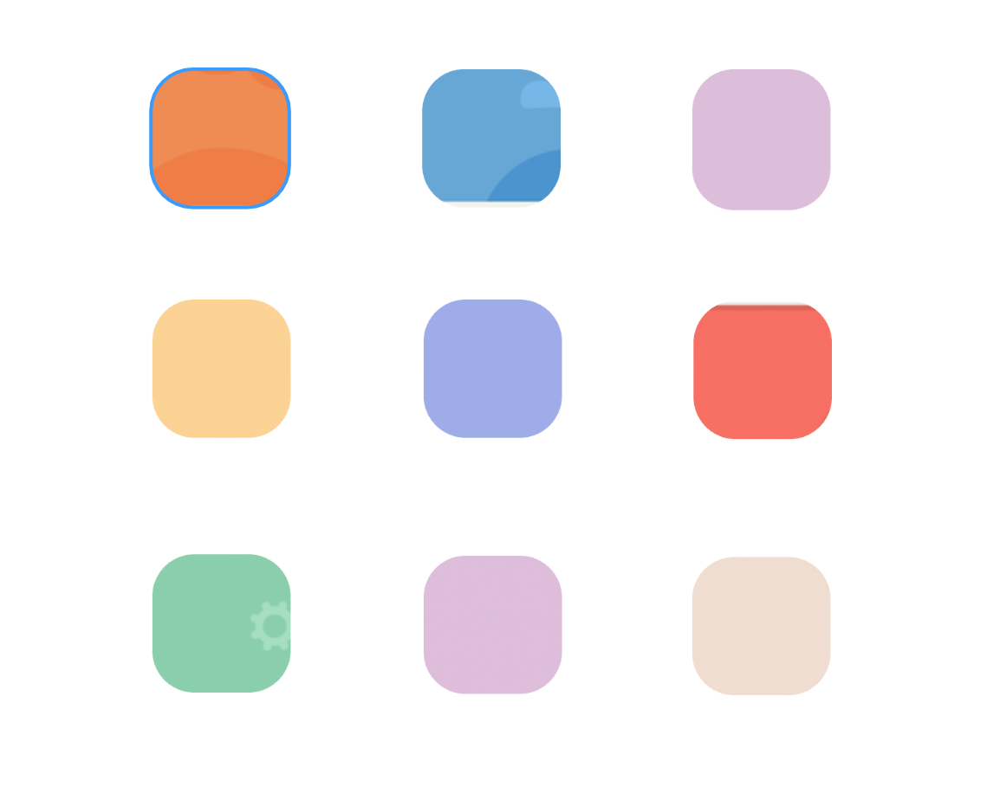

      <i>What's the general mood when you see these colors? Happy, peaceful, and calm are words that immediately come to my mind.</i>

---

Take the home screen as an example. In the viewport, there are 3 identifiable sections, each with only a few components that are clearly separated by whitespace. This leaves little to do besides getting started on a session of meditation using the two easily identifiable ‘play’ buttons.

      <i>Home Screen</i>

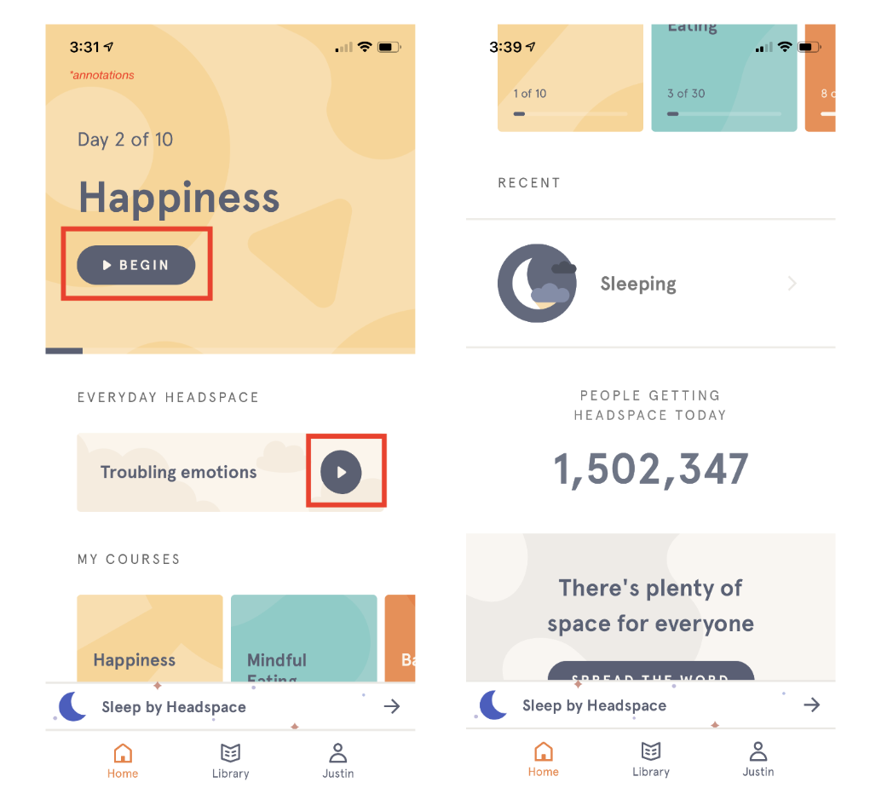
 

      <i>Can you guess what gesture you would use on the 'My Courses' section? If you guessed swipe left, then you guessed right! There was no need for any navigation indicator, the design made it clear which gesture to use.</i>

---

I also really like the ‘People getting headspace today’ section. The subtle use of descriptive norms motivates me to start using the app. I almost feel as if I'm missing out by not doing so.

#### Iconography and custom art style

Icons are stripped to the bare minimum. I personally think this a great design choice – icons aren’t the place to be creative. Fewer graphic details aid recognition, making icons adhere to the principle of affordance: where an object’s sensory characteristics intuitively imply its functionality and use.

      <i>Headspace's Icons</i>

    
 

      <i>Notice how simple the icons are, as well the high contrast with the background to make them pop. They are also placed on the left side of the text for natural readability.</i>

---

While scrolling through Headspace, I wondered why I liked the cartoony art style so much. Sure, it looks nice, but what else is there? After some thought, I realized it’s because the art style in no way reminds me of the common clichés surrounding meditation e.g. incense, vegetarians, and yoga mats. **_Headspace is essentially rebranding meditation_**. Headspace has these animated shorts which use cute characters and storytelling to present meditation as a universal tool for solving everyday problems, rather than this mystic, ancient ritual. Genius! The custom art style and characters fit together nicely to create a cohesive art library.

      <i>Library Screens</i>

    
 

      <i>Notice that each category of meditation has its own mini color scheme which serves as a visual cue to the user during navigation to notify that content has changed. This attention to detail and commitment to create cohesion and consistency is really impressive, making the UI a joy to use.
</i>

### 2. Presentation of material

---

Something else I really appreciate is how easy it is to navigate around the app without feeling overwhelmed by the abundance of choice. The [**paradox of choice**](https://www.amazon.com/dp/B000TDGGVU/ref=dp-kindle-redirect?_encoding=UTF8&btkr=1) is a psychological phenomenon coined by a study in 2000 that explains how if a person is presented with too many choices, they are less likely to take action. Not only that, [a user's reaction time also goes down with an increased number of choices](https://www.interaction-design.org/literature/article/hick-s-law-making-the-choice-easier-for-users.). Having users reacting quickly to the UI is so important since most of the content on Headspace is either through a recording or animation.

Lets take a look at the home screen once again:

      <i>Home screen</i>

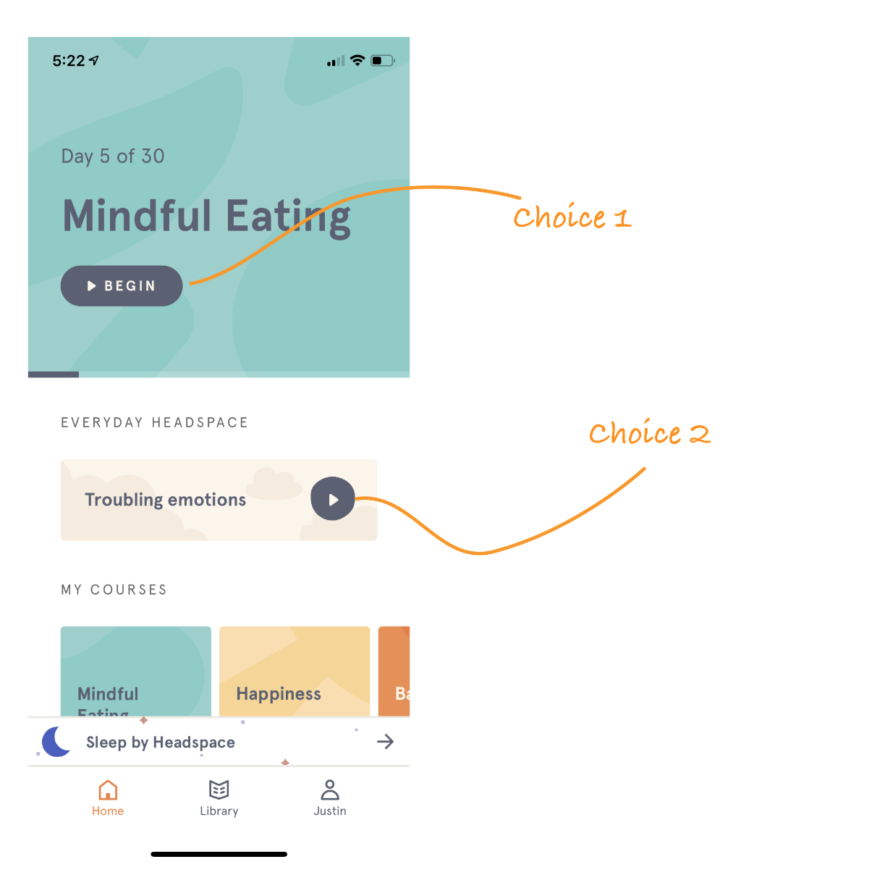

---

The largest section of the home screen is just a large title card displaying the current course the user is on. There is also an ‘Everyday Headspace’ section for spontaneous exploration. Only when the user scrolls down can they see a section for their other active courses: a section linking to the ‘sleep by headspace feature,’ a section showing the number of Headspace users, and a section to ‘spread the word’ about headspace. At first glance, there are essentially only 2 choices to make on the home screen, **both of which are to start a session of meditation.**

Not convinced? Alright, take a look at the library screen:

      <i>Library screen</i>

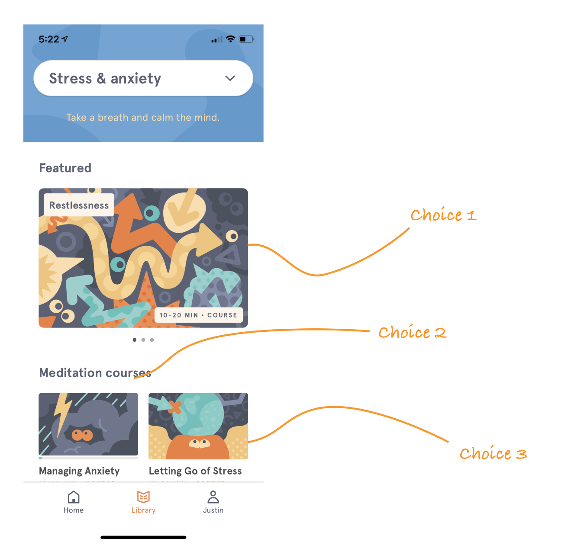    

      <i>3 immediate choices. Less really is more.</i>

---

First off, I love the dropdown menu’s function as both a header and navigation tool. It stays on the top of the viewport when browsing content, which makes navigation feel very fluid. Looking at the screen, notice once again there is first a big ‘featured’ section with 1 course on display that takes up more than half the viewport. After that you get to see two other meditation courses. **There are only 3 courses displayed on the screen!**

### 3. Incredible onboarding and early user engagement

The onboarding of the app is really phenomenal. With a big problem being the misconceptions around meditation, you would think the first onboarding screen would address this point. Instead, onboarding focusses on addressing why you’re using the app and how you're going to use the app.

The onboarding process consists of five simple screens / steps.

      <i>1. Personalized introduction</i>

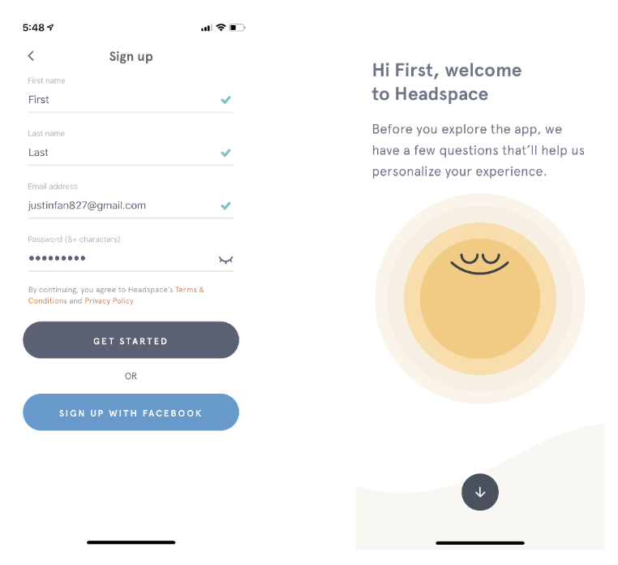    

      First, users get a personalized introduction with the playful art style on full display. From the get go, Headspace makes it clear the onboarding process is there to serve the user—to personalize the users experience.

      <i>2. Establish a purpose</i>

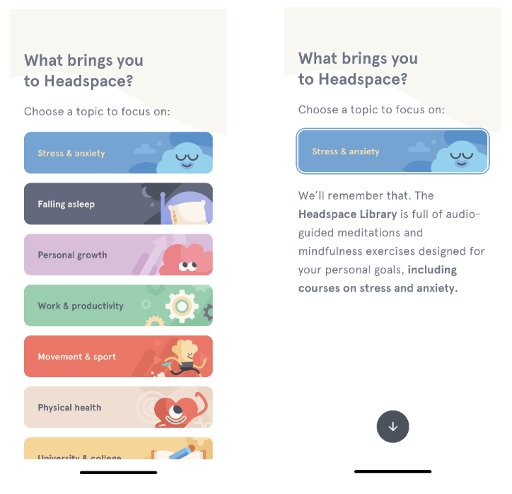    

      Then, users are asked why they are using Headspace, helping users identify an immediate topic to focus on. I <b>loved</b> this step in the onboarding flow because it made me feel as if I had a purpose, a goal to work towards when using the app. I wasn't just mindlessly browsing hoping to find something to work on.

      <i>3. Building a routine</i>

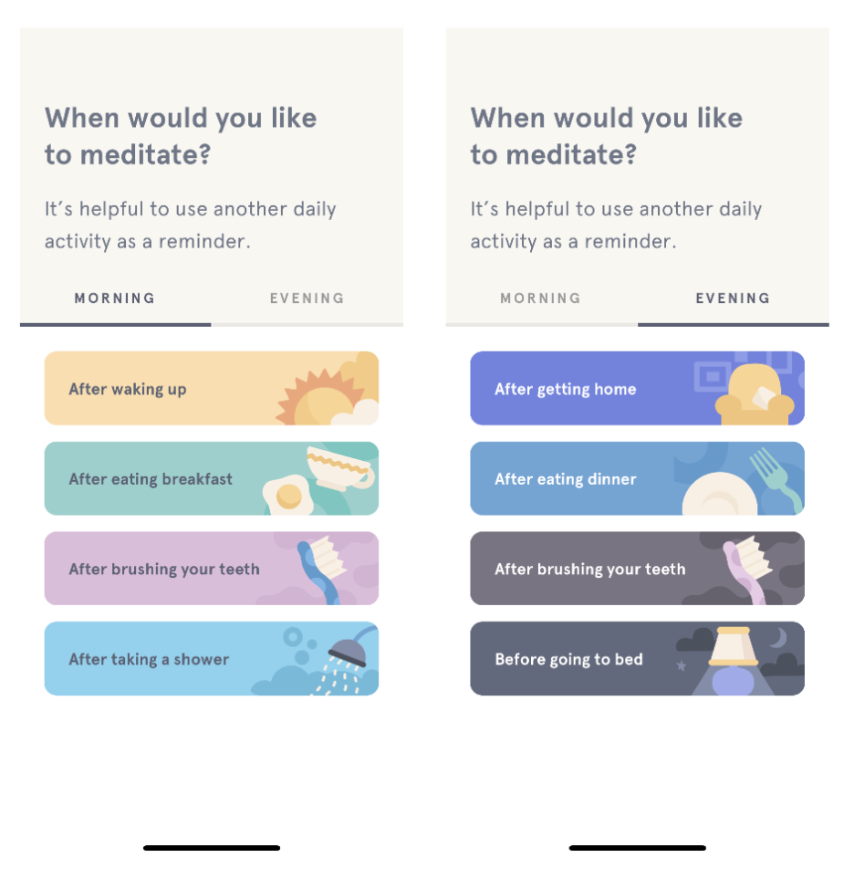    

      Third, users are asked where in their routine they would like to meditate, anchoring meditation habits with an existing habit to help maintain consistency. 

      <i>4. Experience level</i>

    

      Fourth, users are asked about their experience with meditation, which prompts a recommendation for session length (notice there aren't any free choices).

      <i>5. Recap</i>

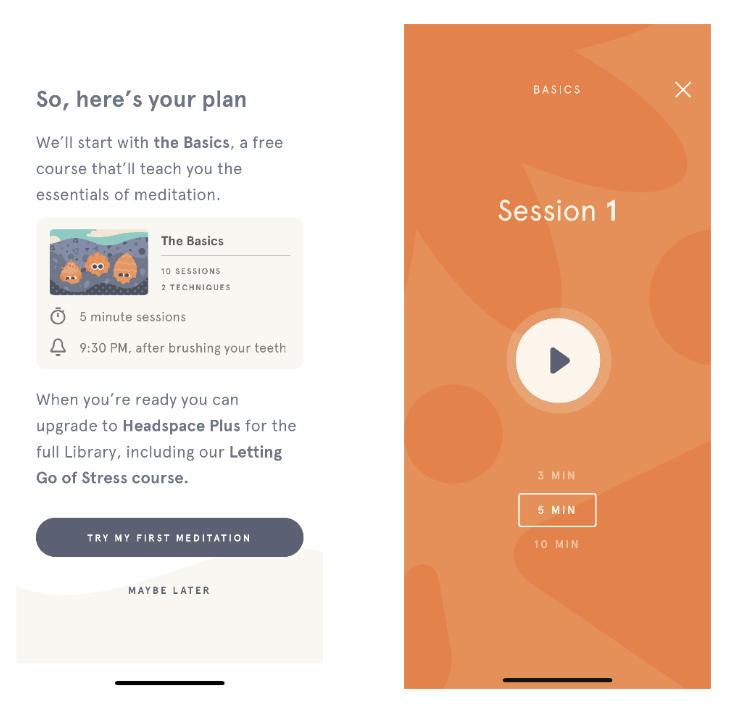    

      Lastly, users are given a quick recap of their answers with a clear call to action to 'try my first meditation’. This onboarding process is so frictionless. I went through it in less than a minute with a clear understanding of <b>how</b> much time I will spend meditating, <b>why</b> I’m meditating, and <b>when</b> in my schedule I've devoted time to meditate.

      <i>Meditation basics course</i>

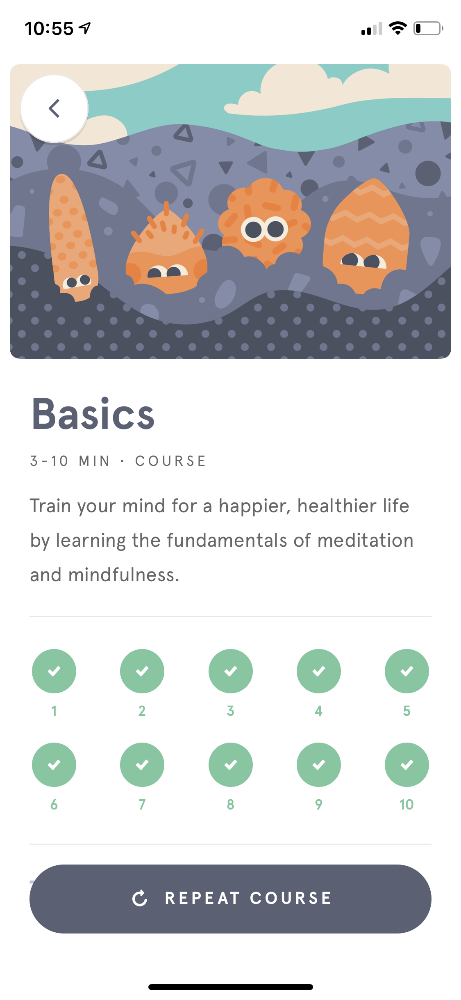

After onboarding, users immediately begin the 10 day beginners’ course which then proceeds to walk you through what meditation is like. Given that I’ve just gone through an onboarding process where I identified my purpose in using Headspace, I felt really motivated to start a session of meditation. 10 days of meditation was also a sufficient time frame for me to really feel the benefits of meditation. I found myself calmer than usual, more aware of my breath, body, and mind, and just more comfortable in my own skin.

### 4. Self-awareness and a deep understanding of user needs

I love how aware Headspace is of its users. Most of us have misconceptions about meditation and are beginners who don’t have any clue how to meditate. The concept of sitting down and just doing absolutely nothing everyday seems so counterproductive to many of us! Headspace however, presents meditation as a tool to solve our everyday problems by categorizing different courses/sessions according to different struggles we may face (e.g. work and productivity, life challenges, movement and sport), making the sessions immediately applicable to our daily lives. Also, when using the app, I often had a specific goal or problem in mind and **these categories made it really easy to find the content I needed.**

      <i>Headspace categories</i>

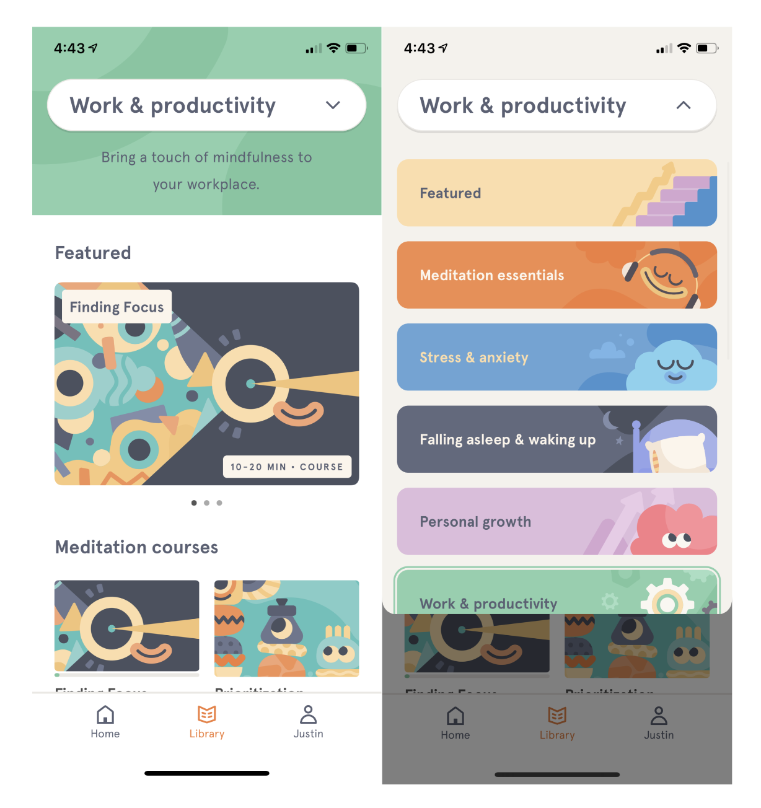    
 

      <i>Meditation to help with work and productivity!? Sign me up.</i>

---

#### Structure of individual sessions

Even the individual sessions themselves help to address the two issues of misconceptions and lack of experience. When starting each session of a course, there are a few educational screens which provide information about general meditation techniques, the focus of the session, and words of encouragement. Sometimes there is even a brief animation to explain our complex minds in a relatable and engaging way. (These animations use the same art style and color palette as the app. Hooray for consistency!). After the intro, Andy Puddicombe leads you through a meditation session. And let me just say, **Andy Puddicombe’s voice is like butter**. Something about his calm, British accent makes each session very pleasant to listen to. The session concludes with a brief reflection that brings attention to how you feel and how the ‘mind’ felt during the meditation session. This structure makes each session feel very focused. With each session, I learn something tangible and have something specific to reflect on, creating a cycle of improvement that makes taking on another session that much more exciting and fulfilling—I feel as if I become more aware and ‘mindful’ with each day of using Headspace!

      <i>The flow of each session</i>

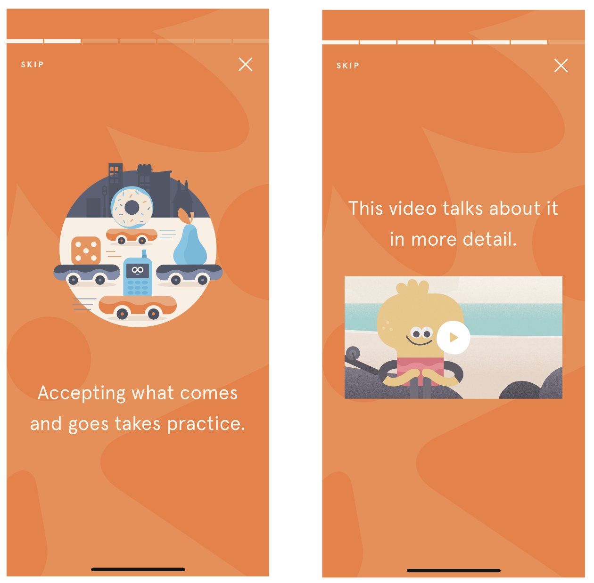    

      <i>(1) Educational screen (2) If you're lucky you get an animation!</i>

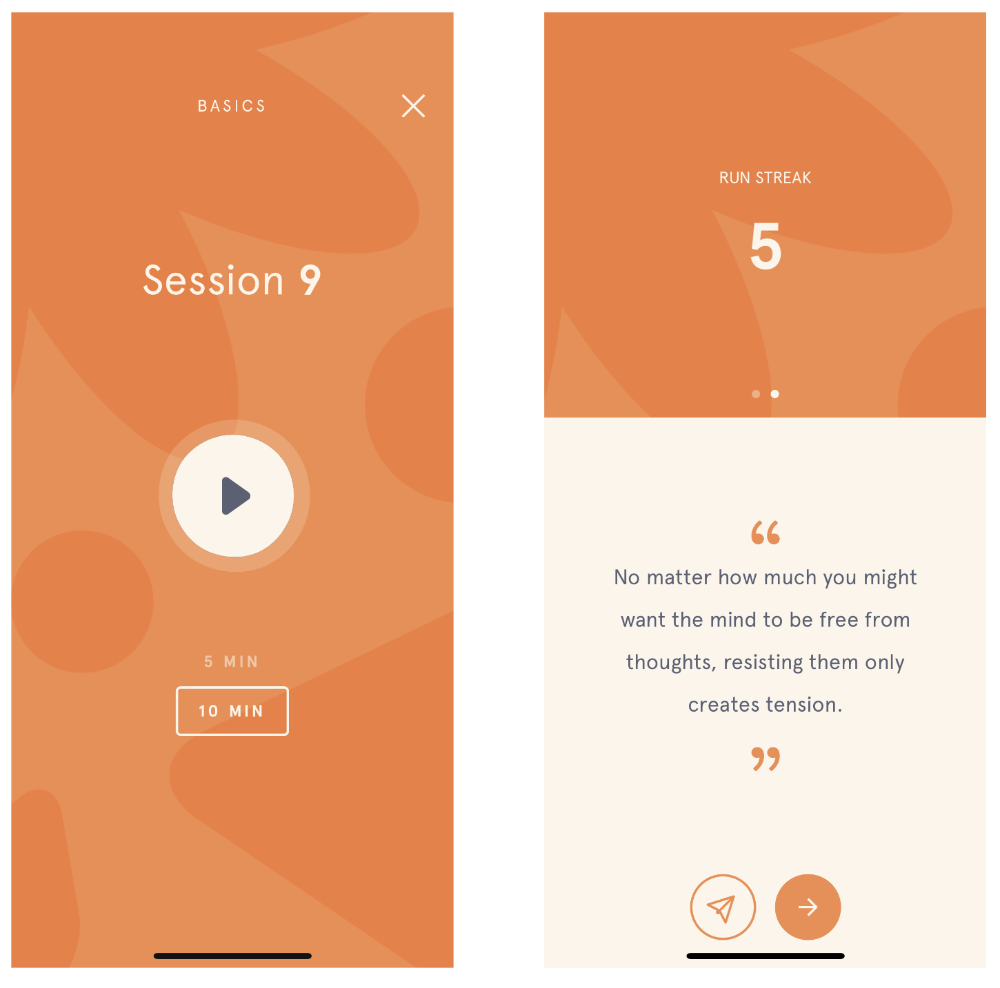    

      <i>(3) Simple call to action to start meditating (3) Post-meditation reflection</i>

 

---

You would think that it’d be easy to carve out 10 minutes a day every day to meditate but building consistency when learning a new skill is always the hardest part. It’s so easy to just say _"oh I’ll do it tomorrow"_. **_So how does Headspace help the user with consistency? Gamification._**

#### Gamification

What is gamification? Glad you asked:

> [Gamification](https://en.oxforddictionaries.com/definition/gamification) is defined as "the application of typical elements of game playing (e.g. point scoring, competition with others, rules of play) to other areas of activity, typically as an online marketing technique to encourage engagement with a product or service."

In other words, gamification is a technique often used to improve user engagement. When this technique is too blatantly used, apps can often feel cheap and be reduced to simple games that can get boring quite quickly. This isn’t the experience I had using Headspace.

Headspace does use streaks to motivate you to come back to the app, but rather than focusing on point scoring or creating competition with others to see who meditated more, Headspace’s tracking system is based around this idea of your meditation ‘journey’. Each session you complete shows up as a progress point in your journey. As you continue on your journey, Headspace celebrates certain milestones with you, reminding you of the lessons you’ve learned up to that point and what to look forward to as you keep going.

      <i>My meditation journey</i>

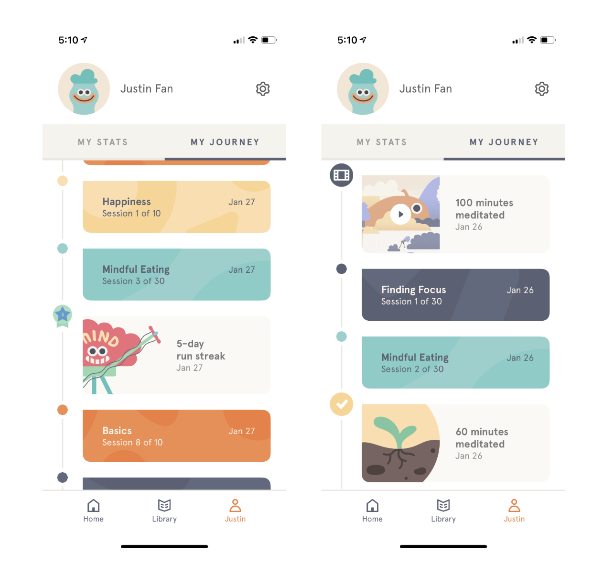    

      <i>There is a milestone for my 5-day streak, but it is only a small part of what constitutes my journey. Each sessions is added to the 'ladder' of progress, making me feel like a truly ~mindful fella~</i>

---

It’s almost as if with each session you’re crafting your own meditation narrative—a personal path towards mindfulness. This notion of your own ‘journey’ is so powerful on a psychological level because gamification oftentimes just uses extrinsic rewards such as ‘gold points’ or ‘gems’ to generate extrinsic motivation, but the ‘journey’ makes the rewards intrinsic by nature. It’s not about what level you get to, it’s about how far you’ve gone in investing in your own mindfulness. This generates tremendous intrinsic motivation which according to research is one of the best ways to create long-term behavior change. In other words, the notion of the ‘journey’ helps users stay consistent with their meditation!

<!--
__*But wait… there’s more!*__

#### Fulfilling psychological needs

Intrinsic motivation is closely tied to the  theory of [self-determination](https://positivepsychologyprogram.com/self-determination-theory/), which states that

> people are motivated by three universal psychological needs: competence, relatedness, and autonomy. When we satisfy these needs, we enhance self-motivation.

_Autonomy_ refers to the need to feel like we are the masters of our own destiny. This need is fulfilled since Headspace’s freemium business model isn’t restrictive (i.e. once you purchase headspace, you gain access to all the sessions/ courses), and users are free to choose whatever session they like to add to their personal journey.

_Competence_ refers to our need to build competence and develop mastery over tasks that are important to us. This is fulfilled as well since Headspace presents mindfulness and meditation as a skill to learn, and the sessions are categorized into different everyday problems, which makes each session feel like an investment in finding a solution to that problem (i.e. by adding a ‘mindful eating’ session to my journey it feels as if I’ve gotten more competent at managing my eating habits).

_Relatedness_ refers to the need to interact with others. In this aspect, Headspace is lacking. Although Headspace does have a feature allowing you to ‘add a buddy’ and see their meditation stats, it doesn’t really allow for any active engagement with other users (scroll to the bottom for more info). -->

I'm personally very interested in the intersection of technology, health, and wellness, which is why I was so excited to try Headspace. I’ve used plenty of other wellness apps, but most of them just provide one size fits all solutions. For example, the FitBit tracker sets a fixed goal of 10,000 steps for all of its users instead of setting one based on their fitness and needs. I believe that rather than glorifying an arbitrary end-goal, health and wellness apps should be in the business of empowering their users. We should be using a wellness app that tailors its experience to help us meet our own goals instead of a rigid and impersonal one. Headspace allows users to freely make informed choices by showing them several courses that have scientifically-backed benefits. And this, in my opinion, is what makes Headspace shine.

As you can probably tell from this review, I’ve really bought into Headspace and the benefits. I’m a skeptical person who takes a lot of convincing when trying something new, but the combination of beautiful, functional design, quality content, and dedication to studying the scientific validity of meditation has got me sold. I’m a fan of Headspace, and if you try it for 10 days, **_I’m sure you will be too._**

## Sounds like the perfect app! Is there room for improvement?

Of course there is! I love Headspace, but nothing is perfect. There is always room for improvement.

1. I wish the ‘add a buddy’ feature was fleshed out more. There needs to be more interaction with other Headspace users than just viewing their statistics. Perhaps a mini Q & A style blog where individuals can share their personal experiences and success stories with using Headspace, or a ‘group meditation’ feature which allows individuals to join live meditation sessions led by a trained instructor.
2. There isn’t any reusability in the sessions / courses. Once you’re finished with a course, there is no way to save it in any way to explore again. I would like to see a search feature so I could find specific sessions. It would also be very helpful if users could create their own set of courses (perhaps sharing those packs with others) to create an even more personal experience.
3. I love reading about the scientific research on meditation, but I understand that research papers aren’t the easiest to read. Currently, users can visit the website to view the research, but it isn't really accessible. It would be great to have a way to view the research in the app. For example, leverage the already existing animations that explain meditation concepts and create short summaries that cite research publications, or create a blog style feature where users can browse a library of research papers that have been simplified and shortened.

---

      <b>Phew! Writing that definitely took up a lot of headspace. Thank you so much for taking the time to hear my perspective! In the meantime, I might do a deep dive into the ‘student’ section of Headspace in preparation for the upcoming midterms.</b>
        
       
      Got any questions for me? Feel free to <a href="mailTo:justinfan827@gmail.com">reach out!</a>

