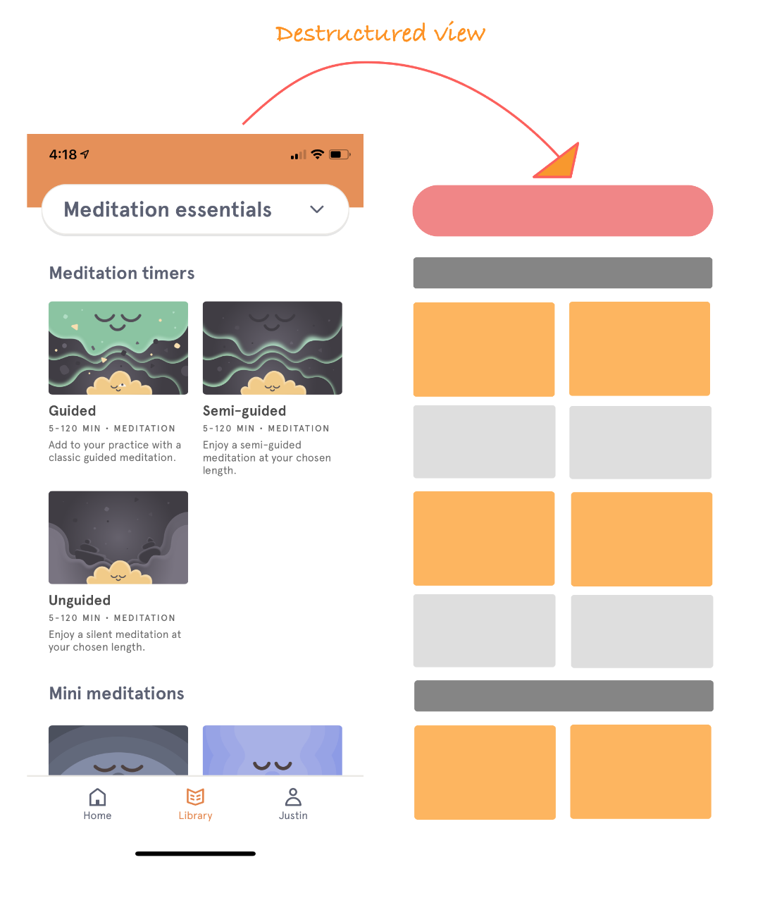

## How did I come across Headspace?

---

The semester was hitting peak stress levels and I was looking to add to my ever-increasing arsenal of destressing techniques. A close friend suggested I use the app ‘Headspace: Meditation’ to meditate and get some… well… headspace I suppose. I was skeptical—isn’t meditation just some ancient, hokey pokey, pseudo-science practice? After some preliminary research, it turns out there is mounting evidence about meditation’s short and long-term benefits! In fact, Headspace works in tandem with over 35 research institutions and organizations, participating in over 65 studies to validate the benefits of meditation, most of which are third-party studies with no affiliation with Headspace. I was still doubtful, but was I willing to try given the upcoming hell-week filled with countless assignments and midterms? _Oh yes_.

## What is Headspace? Why use it?

---

Like its name suggests, [**Headspace is a meditation app that acts as your digital meditation guru**](https://www.headspace.com/). The goal of the app is to teach you how to be mindful and how to familiarize yourself with the present moment. Created by the former Buddhist monk **Andy Puddicombe**, the app has a wide variety of meditation courses split into bite-sized sessions, organized into specific categories such as stress relief, sleep, anxiety, sports, kids, and more. Beginners can short 3, 5, or 10 minute sessions, while more experienced individuals can opt in for longer sessions that go up to 60 minutes. Andy Puddicombe himself leads many of these sessions. His soothing voice guides you through the meditation, helping you achieve mindfulness. The app also tracks your progress and allows you to connect with friends to see their progress as well.

> [Mindfulness](https://www.headspace.com/meditation-101/what-is-meditation) is defined as "the ability to be present, to rest in the here and now, fully engaged with whatever we’re doing in the moment".

I initially looked to Headspace as a tool to manage my stress, but now I can't imagine starting out my day without a session of meditation. Did you know that according to a Harvard study, [we spend 47% of our time thinking about something other than what we're currently doing!?](https://news.harvard.edu/gazette/story/2010/11/wandering-mind-not-a-happy-mind/) Using Headspace has definitely helped me live more in the present and be more comfortable with my own mind. 

## Why do I like Headspace?

---

There are 4 main reasons why I love Headspace. 

<h4 align="center">
      <i>1. A beautiful user interface and seamless user experience</i>
</h4>

<h4 align="center">
      <i>2. Self-awareness / deep understanding of user needs</i>
</h4>

<h4 align="center">
      <i>3. Well thought out presentation of material</i>
</h3>

<h4 align="center">
      <i>4. Incredible onboarding / early user engagement</i>
</h4>

### 1. UI / UX: functional design that serves a purpose

The app is gorgeous and incredibly polished. It’s just so pleasing to look at. When I think of meditation, I think of peace, warmth, and tranquility, and this is the exact feeling I get when interacting with the app’s simple UI. You can tell how ‘mindful’ (excuse the pun) the design team was in making a user-centric app. The apps intuitive navigation, custom components, simple color-scheme, and playful art style come together to create a seamless and satisfying user experience.

#### Color scheme / layout

The app uses a muted pastel color scheme, featuring very few dark tones. There are very few design elements on each screen and a lot of negative whitespace, creating clutter-free screens. Because there is so much whitespace, the different colored sections really pop out at you and are very easy to identify. The typography is also very consistent. Headings and subheadings across screens have the same font style and size, making transitions feel very natural. Thanks to the contrast between whitespace and colored elements and readable typography, interface elements are always clearly identifiable—I was never confused about what could be clicked / swiped on or what the interface element was for. All this makes it very easy to begin a session of meditation and find new courses/sessions, which is precisely what the goal of the app is.

      <i>Headspace colors</i>

      <i>What's the general mood when you see these colors? Happy, peaceful, calm are words that immediately come to my mind.</i>

--- 

Take the home screen as an example. In the viewport, there are 3 identifiable sections, each with only a few components clearly separated by whitespace. This leaves little to do besides getting started on a session of meditation using the two easily identifiable ‘play’ buttons.

      <i>Home Screen</i>

 

      <i>Can you guess what gesture you would use on the 'My Courses' section? If you guessed swipe left, then you guessed right! There was no need for any navigation indicator, the design made it clear which gesture to use!</i>

--- 

I also really like the ‘People getting headspace today’ section. The subtle use of descriptive norms motivates me to start using the app. I almost feel as if I'm missing out by not doing so! 

#### Iconography/ custom art style

Icons are stripped to the bare minimum. I personally think this a great design choice – icons aren’t the place to be creative! Fewer graphic details aid recognition, making icons adhere to the principle of affordance: where an object’s sensory characteristics intuitively imply its functionality and use.

      <i>Headspace's Icons</i>

    
 

      <i>Notice how simple the icons are, as well the high contrast with the background to make them pop. They are also placed on the left side of the text for natural readability.</i>

--- 

While scrolling through Headspace, I wondered why I liked the cartoony art style so much. Sure, it looks nice, but what else is there? After a while I realized it’s because the art style in no way reminds me of the common cliché’s surrounding meditation e.g. incense, vegetarians, and yoga mats. __*Headspace is essentially rebranding meditation.*__ Headspace has these animated shorts which use cute characters and storytelling to present meditation as a universal tool for solving everyday problems, rather than this mystic, ancient ritual. Genius! The custom art style and characters fit together nicely to create a cohesive art library. 

      <i>Library Screens</i>

    
 

      <i>Notice that each category of meditation has its own mini color scheme which serves as a visual cue to the user during navigation to notify that content has changed. This attention to detail and commitment to create cohesion and consistency is really impressive, making the UI a joy to use.
</i>

<screenshot of animations>

<screen shot of two different categories and their color schemes>

#### Gestalt principles at play

I think that understanding human cognitive mechanisms/ abilities is essential when it comes to crafting a product with a seamless user experience, so when using this app I couldn’t help but bring out the psych nerd in me and notice the gestalt principle of proximity at play:

> The [gestalt principle of proximity](https://tubikstudio.com/gestalt-theory-for-ux-design-principle-of-proximity/) is based on the cognitive tendency to perceive objects close to each other as related, especially in comparison with those which are placed farther.

Take a look at the library screen: 

 

      <i>Library screen</i>

    
 

      <i>I tried my best to match the color scheme. #consistency!</i>

--- 

Each meditation course / session is accompanied with a card element that showcases Headspace’s unique art style. If we strip away the details to look purely at the layout, its clear how the whitespace and sub-headings break the  sections off into different groups.  This principle of proximity allows for complexity and creativity in the art style without making the UI feel cluttered, since research has shown that people group elements using proximity more than either shape or color. I.e __proximity takes precedence over both shape and color.__

### 2. Well thought out / self-aware.

I love how aware Headspace is of its users. Most of us have misconceptions about meditation and are beginners who don’t even know how to meditate. The concept of sitting down and just doing absolutely nothing seems so counterproductive in our everyday lives! Headspace presents meditation as a tool to solve our everyday problems by categorizing different courses / sessions according to the different struggles that we each face on a daily basis (e.g. work and productivity, life challenges, movement and sport), making the sessions immediately applicable to our daily lives. 

      <i>Headspace categories</i>

    
 

      <i>Meditaiton to help with work and productivity!? Sign me up.</i>

--- 

When using the app, I often had a specific goal in mind—some specific problem that I wanted to work on—and __these categories made it really easy to find the content I needed.__

#### Structure of individual sessions

Even the individual sessions themselves help to address the two issues of misconceptions and lack of experience. When starting each session of a course, there are a few educational screens which provide information about general meditation techniques, the focus of the session, and words of encouragement. Sometimes there is even a brief animation to explain our complex minds in a relatable and engaging way (the animations use the same art style and color palette as the app. Hooray for consistency!). After the intro, Andy Puddicombe leads you through a meditation session. _Andy Puddicombe’s voice is like butter_. Something about his calm, British accent makes each session very pleasant to listen to. The session concludes with a brief reflection that brings attention to how you feel after the session and how the ‘mind’ felt during the meditation session. This structure made each session feel very focused. With each session, I learned something tangible and had something specific to reflect on, creating a cycle of improvement that made taking on another session that much more exciting and fulfilling—I felt as if I was becoming more aware and ‘mindful’ with each day of using Headspace!

      <i>The flow of each session</i>

    

      <i>(1) Educational screen (2) If you're lucky you get an animation!</i>

    

      <i>(3) Simple call to action to start meditating (3) Post-meditation reflection</i>

 

---

You would think that it’d be easy to carve out 10 minutes a day every day to meditate but building consistency when learning a new skill is always the hardest part. It’s so easy to just say _"oh I’ll do it tomorrow"_. __*So how does Headspace help the user with consistency? Gamification.*__

#### Gamification

What is gamification? Glad you asked:

> [Gamification](https://en.oxforddictionaries.com/definition/gamification) is defined as "the application of typical elements of game playing (e.g. point scoring, competition with others, rules of play) to other areas of activity, typically as an online marketing technique to encourage engagement with a product or service."

In other words, gamification is a technique often used to improve user engagement. When this technique is too blatantly used, apps can often feel cheap and be reduced to a simple game which can get boring quite quickly. __This isn’t the experience I had using Headspace__. Headspace does use streaks to motivate you to come back to the app, but rather than focusing on point scoring, or creating competition with others to see who meditated more, Headspace’s tracking system is based around this idea of your meditation ‘journey’. Each session you complete shows up as a progress point in your journey and as you continue on your journey, Headspace celebrates certain milestones with you, reminding you of the lessons you’ve learnt up to that point and what to look forward to as you keep going.

      <i>My meditation journey</i>

    

      <i>There is a milestone for my 5-day streak, but it is only a small part of what constitutes my journey. Each sessions is added to the 'ladder' of progress, making me feel like a truly ~mindful fella~</i>

---

It’s almost as if with each session you’re crafting your own meditation narrative—a personal path towards mindfulness. This notion of you own ‘journey’ is so powerful on a psychological level because gamification oftentimes just uses extrinsic rewards such as ‘gold points’ or ‘gems’ to generate extrinsic motivation, but the ‘journey’ makes the rewards intrinsic by nature. It’s not about what level you get to, it’s about how far you’ve gone in investing in your own mindfulness. This generates tremendous intrinsic motivation which according to research is one of the best ways to create long-term behavior change. In other words, the notion of the ‘journey’ helps users stay consistent with their meditation! 

__*But wait… there’s more!*__

#### Fulfilling psychological needs

Intrinsic motivation is closely tied to the theory of [self-determination](https://positivepsychologyprogram.com/self-determination-theory/), which states that

> people are motivated by three universal psychological needs: competence, relatedness, and autonomy. When we satisfy these needs, we enhance self-motivation.

_Autonomy_ refers to the need to feel like we are the masters of our own destiny. This need is fulfilled since Headspace’s freemium business model isn’t restrictive (i.e. once you purchase headspace, you gain access to all the sessions/ courses), and users are free to choose whatever session they like to add to their personal journey.

_Competence_ refers to our need to build competence and develop mastery over tasks that are important to us. This is fulfilled as well since Headspace presents mindfulness and meditation as a skill to learn, and the sessions are categorized into different everyday problems, which makes each session feel like an investment in finding a solution to that problem (i.e. by adding a ‘mindful eating’ session to my journey it feels as if I’ve gotten more competent at managing my eating habits).

_Relatedness_ refers to the need to interact with others. In this aspect, Headspace is lacking. Although Headspace does have a feature allowing you to ‘add a buddy’ and see their meditation stats, it doesn’t really allow for any active engagement with other users (scroll to the bottom for more info).

### 3. Presentation of material

---

Something else I really appreciate is how easy it is to navigate around the app yet not feel overwhelmed by the abundance of choice. The [__paradox of choice__](https://www.amazon.com/dp/B000TDGGVU/ref=dp-kindle-redirect?_encoding=UTF8&btkr=1) is a psychological phenomenon coined by a study in 2000 that explains how if a person is presented with too many choices, they are less likely to take action. Not only that, [a user's reaction time also goes down with an increased number of choices](https://www.interaction-design.org/literature/article/hick-s-law-making-the-choice-easier-for-users.). Having users reacting quickly to the UI is so important since most of the content on Headspace is either through a recording or  animation. 

Lets take a look at the home screen once again:

      <i>Home screen</i>

    

      <i>Should I meditate? ... Or should I meditate?</i>

---
The largest section of the home screen is just a large title card displaying the current course the user is on. There is also an ‘Everyday Headspace’ section for spontaneous exploration, but only when the user scrolls down can they see a section for their other active courses, a section linking to the ‘sleep by headspace feature,’ a section showing the number of Headspace users, and a section to ‘spread the word’ about headspace. At first glance, there are essentially only 2 choices to make on the home screen, __both of which are to start a session of meditation.__

Not convinced? Alright, take a look at the library screen:

      <i>Library screen</i>

    

      <i>3 immediate choices. Less really is more.</i>

---

First off, I love the dropdown menu’s function as both a header and navigation tool and how it stays on the top of the viewport when browsing content—this makes navigation feel very fluid. Looking at the screen, notice once again there is first a big ‘featured’ section with 1 course on display that takes up more than half the viewport. After that you get to see two other meditation courses. __There are only 3 courses displayed on the screen!__ 

### 4. Amazing onboarding / early user engagement

The onboarding of the app is really phenomenal. With a big problem being the misconceptions around meditation, you would think the first onboarding screen would address this point. Instead, onboarding is focused on addressing why you’re using the app and how you're going to use the app.

The onboarding process consists of five simple screens / steps. 

      <i>1. Personalized introduction</i>

    

      <i>From the get-go, the design on the app feels unique and unrelated to the clichéd notions of meditation.</i>

First, users get a personalized introduction with the playful art style on full display. From the get go, Headspace makes it clear the onboarding process is there to serve the user—to personalize the users _experience_. 

      <i>2. Establish a purpose</i>

    

      <i>The semester can be rough sometimes, but Headspace is here to the rescue!</i>

Then, users are asked why they are using Headspace, helping users identify an immediate topic to focus on. I __*loved*__ this step in the onboarding flow because it made me feel as if I had a purpose, a goal to work towards in using the app. I wasn't just mindlessly browsing hoping to find something to work on.

      <i>3. Building a routine</i>

    

      <i>I actually like my meditation right after I wake up, but I pressed the wrong button. Woops.</i>

Third, users are asked where in their routine they would like to meditate, anchoring meditation habits with an existing habit to help maintain consistency. 

      <i>4. Experience level</i>

    

      <i>I was a complete meditation amateur. 3 minutes seemed like plenty.</i>

Fourth, users are asked about their experience with meditation, which prompts a recommendation for session length (notice there aren't any free choices).

      <i>5.</i>

    

      <i>I was a meditation amateur. 5 minutes seemed like plenty.</i>

Lastly, users are given a quick recap of their answers with a clear call to action to 'try my first meditation’. This onboarding process is so frictionless. I went through it in less than a minute with a clear understanding of __how__ much time I will spend meditating, __why__ I’m meditating, and __when__ in my schedule I've devoted time to meditate.

**Almost done with this review. I promise! There’s a lot to love about this app.**

      <i>Meditation basics course</i>

    

After onboarding, there is a 10 day beginners’ course which then proceeds to walk you through what meditation is like. Given that I’ve just gone through an onboarding process where I identified my purpose in using Headspace, I felt really motivated to start a session of meditation. 10 days of meditation was also a sufficient time frame for me to really feel the benefits of meditation. I found myself calmer than usual, more aware of my breath, body, and mind, and just more comfortable in my own skin.

As you can probably tell from this long review, I’ve really bought into Headspace and the benefits. I’m a skeptical person who takes a lot of convincing when trying something new, but the combination of beautiful, functional design, quality content, and dedication to studying the scientific validity of meditation has got me sold. I’m a fan of Headspace, and if you try it for 10 days, __I’m sure you will be too.__

## Sounds like the perfect app! Is there room for improvement?

Of course there is! I love Headspace, but nothing is perfect. There is always room for improvement.

1.  I wish the ‘add a buddy’ feature was fleshed out more. There needs to be more interaction with other Headspace users than just viewing their statistics. Perhaps a mini Q & A style blog where individuals can share their personal experiences and success stories with using Headspace, or a ‘group meditation’ feature which allows individuals to join live meditation sessions led by a trained instructor.
2.  There isn’t any reusability in the sessions / courses. Once you’re finished with a course, there is no way to save it in any way to explore again. I would like to see a search feture so I could find specific sessions. It would also be very helpful if users could create their own set of courses (perhaps sharing those packs with others) to create an even more personal experience.
3.  I love reading about the scientific research on meditation, but I understand that research papers aren’t the easiest to read. Currently, users can visit the website to view the research, but it isn't really accessible. It would be great to have a way to view the research in the app. For example, leverage the already existing animations that explain meditation concepts and create short summaries that cite research publications, or create a blog style feature where users can browse a library of research papers that have been simplified and shortened.

___

      <b>Phew! Writing that definitely took up a lot of headspace. Thank you so much for taking the time to hear my perspective! In the meantime, I might do a deep dive into the ‘student’ section of Headspace in preparation for the upcoming midterms.</b>
        
       
      Got any questions for me? Feel free to <a href="mailTo:justinfan827@gmail.com">reach out!</a>

